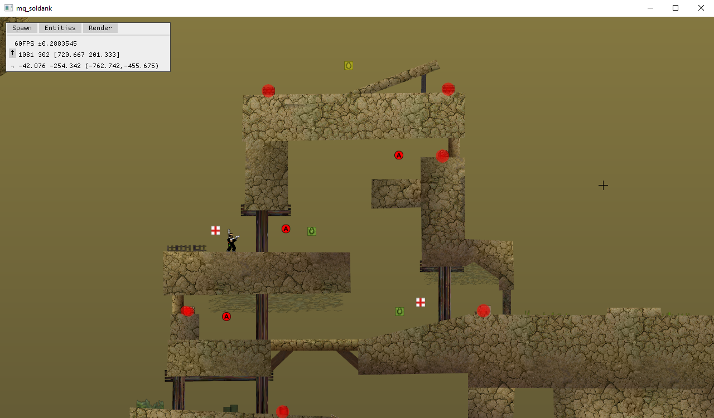

# Soldank

[WIP] open source clone of [Soldat](http://soldat.pl/) engine written in Rust

## WIP Screenshot



## Goals

* Fully authentic look and feel
* ~~bugs~~ feature-complete port of Soldat

## build and run

This repository is configured to store `*.smod` and `*.smap` files in LFS. You will need to install https://git-lfs.github.com/ to handle these.

Alternatively you can build `soldat.smod` from [soldat-base](https://github.com/Soldat/base) and copy to `soldank/client/resources` directory

### Server

    env RUST_LOG=debug cargo run --manifest-path server/Cargo.toml

### Client

    env RUST_LOG=debug cargo run --manifest-path client/Cargo.toml -- --debug

Use `--help` option to display command line help.

```
soldank-server 0.1.0
Tomasz Sterna <tomasz@sterna.link>
open source clone of Soldat engine written in Rust

USAGE:
    soldank-server [OPTIONS]

FLAGS:
    -h, --help       Prints help information
    -V, --version    Prints version information

OPTIONS:
    -b, --bind <address:port>    IP address and port to bind [env: SOLDANK_SERVER_BIND=]
    -k, --key <key>              server connection key [env: SOLDANK_SERVER_KEY=]
    -m, --map <map name>         name of map to load [env: SOLDANK_USE_MAP=]  [default: ctf_Ash]
```

```
soldank-client 0.1.0
helloer <im.helloer@gmail.com>:Tomasz Sterna <tomasz@sterna.link>
open source clone of Soldat engine written in Rust

USAGE:
    soldank-client [FLAGS] [OPTIONS]

FLAGS:
        --debug      display debug UI on start (^` to toggle)
    -h, --help       Prints help information
    -V, --version    Prints version information

OPTIONS:
    -c, --connect <address:port>    server address and port to connect
    -k, --key <key>                 server connection key
    -m, --map <map>                 name of map to load [default: ctf_Ash]
    -n, --nick <nick>               user nickname
        --set <cvar> <value>        set cvar value [multiple]
```

You can use `--set cvar value` option (multiple times) to override config variables.

## TODO

- [x] Refactor rendering code and add support for sceneries and gostek rendering
- [x] Implement proper game loop
- [x] Debug UI
- [x] Use `cvar`s for configuration
- [ ] Implement game interface
- [ ] Server-authoritative networking
- [ ] [Rhai](http://rhai.rs) scripted gameplay and console
