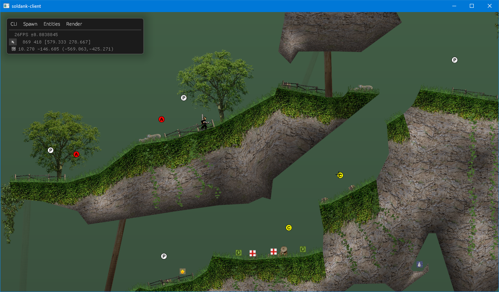

# Soldank

[WIP] open source clone of Soldat engine written in Rust

## WIP Screenshot

## Goals

* Fully authentic look and feel
* ~~bugs~~ feature-complete port of Soldat

## build and run

### Server

    env RUST_LOG=debug cargo run --manifest-path server/Cargo.toml

### Client

    cargo run --manifest-path client/Cargo.toml -- --debug

## TODO

- [x] Refactor rendering code and add support for sceneries and gostek rendering
- [x] Implement proper game loop
- [x] Debug UI
- [ ] Implement game interface
- [ ] server-authoritative networking
